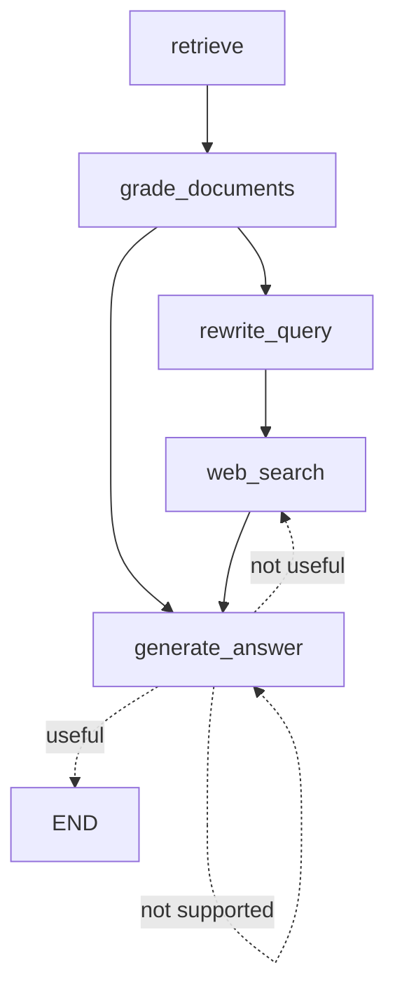

# Advanced RAG System with LangGraph

이 프로젝트는 논문 "A Study on the Implementation Method of an Agent-Based Advanced RAG System Using Graph"에 기반하여 LangGraph를 사용하여 구현된 고급 RAG(Retrieval-Augmented Generation) 시스템입니다.

## 프로젝트 구조

```
.
├── config/         # 설정 파일들
├── chains/         # LangChain 체인 정의
├── state/          # 그래프 상태 관리
├── nodes/          # 그래프 노드 구현
├── utils/          # 유틸리티 함수들
├── main.py         # 메인 실행 파일
├── embedding.py    # 임베딩 관련 기능
└── workflow_graph.md # 워크플로우 그래프 설명
```

## 주요 기능

- 문서 검색 및 평가
- 쿼리 재작성
- 웹 검색 통합
- 답변 생성 및 품질 평가
- 그래프 기반 워크플로우 관리

## 설치 방법

1. 저장소 클론:
```bash
git clone https://github.com/baekdusan/advanced-rag-langgraph.git
cd advanced-rag-langgraph
```

2. 필요한 패키지 설치:
```bash
pip install -r requirements.txt
```

## 사용 방법

1. `main.py` 파일을 실행하여 시스템을 시작합니다:
```bash
python main.py
```

2. 기본적으로 "What's Self-RAG?"라는 질문에 대한 답변을 생성합니다.

3. 다른 질문으로 테스트하려면 `main.py` 파일의 마지막 부분에서 `question` 값을 수정하세요:
```python
result = app.invoke({"question": "원하는 질문을 여기에 입력하세요", "documents": []})
```

4. 다른 문서나 데이터 소스를 사용하려면 `embedding.py` 파일을 수정하세요:
   - `embedding.py` 파일에서 임베딩 모델과 벡터 저장소 설정을 변경할 수 있습니다.
   - 기본적으로 ChromaDB를 사용하며, 다른 벡터 데이터베이스로 변경할 수 있습니다.
   - 임베딩 모델도 원하는 모델로 변경 가능합니다.
   - PDF 파일 경로를 수정하여 다른 문서를 사용할 수 있습니다:
     ```python
     loader = PyPDFLoader("사용할_문서_경로.pdf")  # PDF 파일 경로 수정
     ```

## RAG Workflow Graph



1. **문서 검색 (retrieve)**
   - 질문에 대한 관련 문서를 검색합니다.

2. **문서 평가 (grade_documents)**
   - 검색된 문서의 품질을 평가합니다.
   - 평가 결과에 따라 두 가지 경로로 분기됩니다:
     - 문서가 충분하지 않은 경우: 쿼리 재작성으로 이동
     - 문서가 충분한 경우: 답변 생성으로 이동

3. **쿼리 재작성 (rewrite_query)**
   - 원래 질문을 더 구체적이고 명확하게 재작성합니다.

4. **웹 검색 (web_search)**
   - 재작성된 쿼리로 웹 검색을 수행합니다.

5. **답변 생성 (generate_answer)**
   - 검색된 문서와 웹 검색 결과를 기반으로 답변을 생성합니다.
   - 답변 품질에 따라 세 가지 경로로 분기됩니다:
     - "not supported": 다시 답변 생성 시도
     - "useful": 프로세스 종료
     - "not useful": 웹 검색으로 돌아가서 추가 정보 수집

## 참고 자료

- 논문: "A Study on the Implementation Method of an Agent-Based Advanced RAG System Using Graph"
