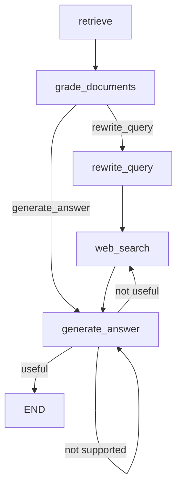

# RAG Workflow Graph

## 설명

1. **retrieve**: 문서 검색 단계
2. **grade_documents**: 검색된 문서 평가
   - 조건에 따라 두 가지 경로로 분기
3. **rewrite_query**: 쿼리 재작성
4. **web_search**: 웹 검색 수행
5. **generate_answer**: 답변 생성
   - "not supported": 다시 답변 생성 시도
   - "useful": 프로세스 종료
   - "not useful": 웹 검색으로 돌아가기 